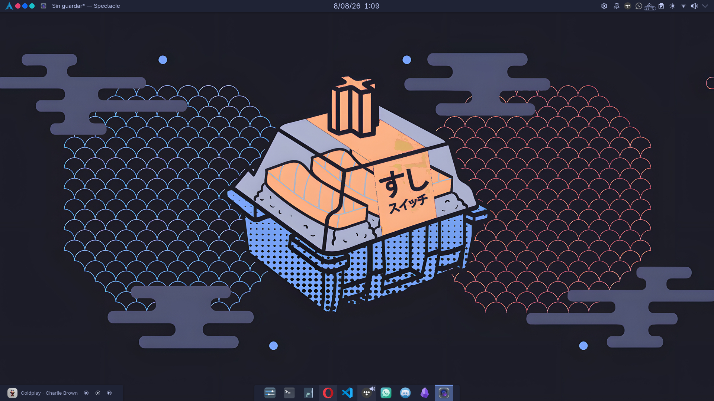
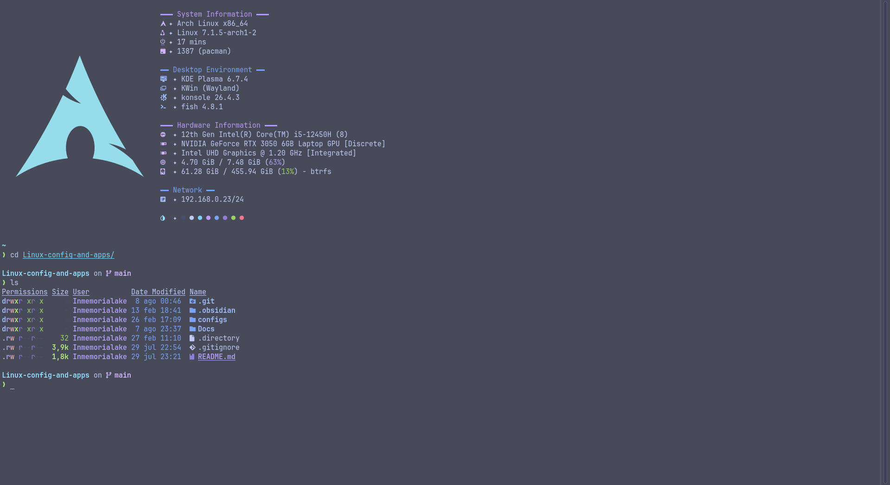
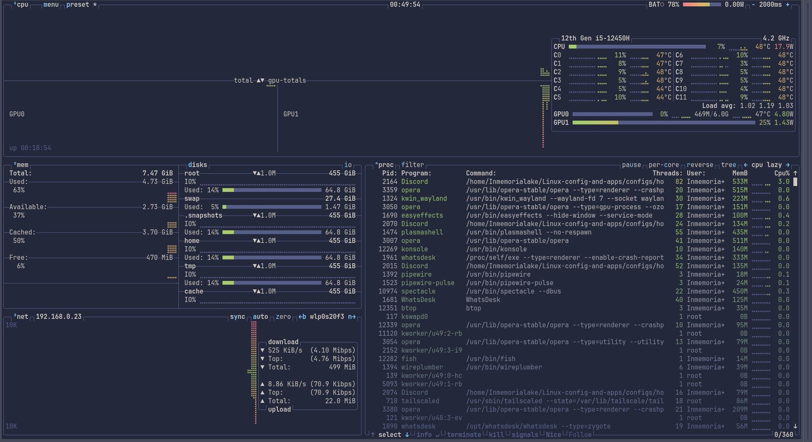
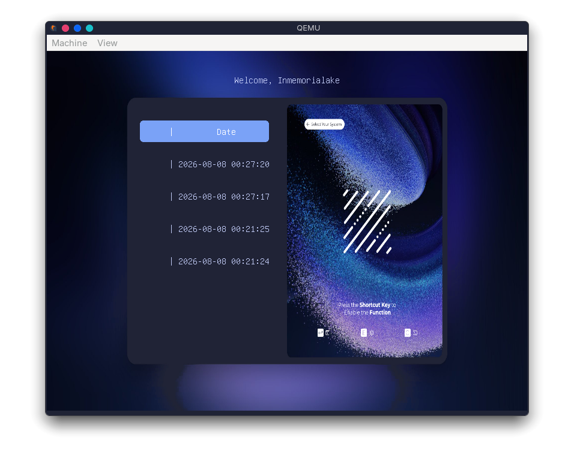
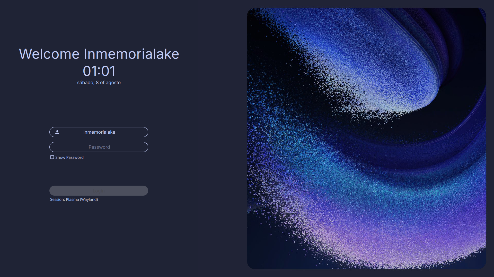
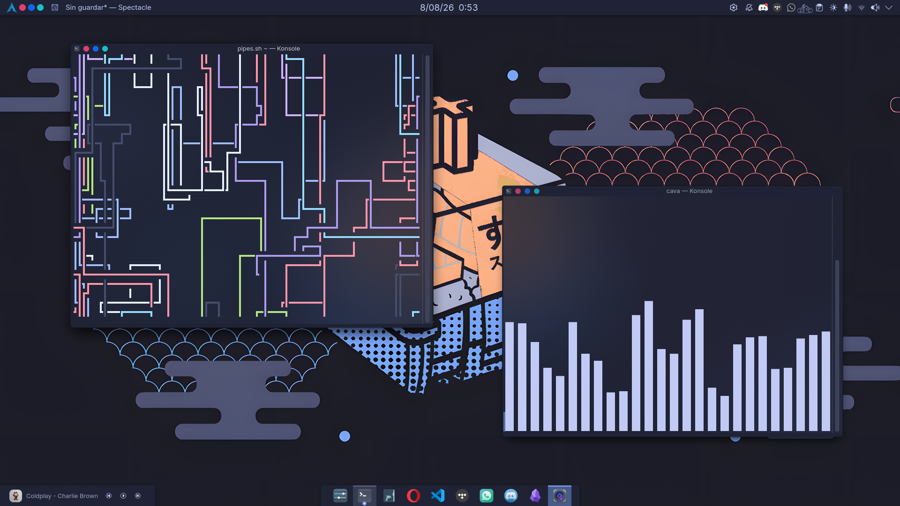

# Linux-config-and-apps

Arch Linux + KDE Plasma (Wayland), fully documented: installation, Btrfs with snapshots, firewall, rice, terminal, gaming, and the maintenance scripts that keep it running day to day.

This repository **lives inside `$HOME`** — it's not an external copy. A handful of top-level symlinks point from `$HOME` into `configs/home/` inside the repo (`~/.config`, `~/.local`, `~/.gitconfig`, `~/.fonts.conf`), so the tracked files *are* the live configuration — there is no sync or copy step. Full mechanism in [`Docs/architecture.md#dotfiles`](Docs/architecture.md#dotfiles).

### Philosophy

- **One source of truth per concern**: the color palette is read straight from the live `.colors` file, not restated by hand ([`04_rice.md#color-palette`](Docs/04_rice.md#color-palette)); the maintenance scripts live under `.local/bin/` and nowhere else ([`maintenance.md`](Docs/maintenance.md)).
- **Precision over completeness**: every section in the docs is read directly from the live config files on this system — where something turns out to be stock/default rather than customized, that's stated explicitly instead of glossed over ([`04_rice.md#overview`](Docs/04_rice.md#overview)).
- **Light-touch config, not a wholesale replacement**: the terminal setup is a 10-line Fish config and mostly-stock tool defaults, not a from-scratch rebuild of coreutils ([`05_Terminal.md#conclusion`](Docs/05_Terminal.md#conclusion)).
- **Reproducible via symlinks, not a copy step**: clone the repo into `$HOME`, recreate the four top-level symlinks, and the live configuration is back — no sync script involved ([`architecture.md#reproducibility`](Docs/architecture.md#reproducibility)).

---

## Screenshots


*Desktop overview — panels, dock, Aurorae window decoration, wallpaper. Full breakdown in [`04_rice.md`](Docs/04_rice.md).*


*fastfetch + eza in Konsole — the shell-startup banner set up in [`05_Terminal.md`](Docs/05_Terminal.md).*


*btop, `tokyo-storm` theme — same palette thread as the rest of the system ([`04_rice.md#color-palette`](Docs/04_rice.md#color-palette)).*


*The grub-btrfs snapshot submenu, captured via `grub2-theme-preview` in QEMU — not a real reboot. See [`02_Btrfs_and_snapshots.md`](Docs/02_Btrfs_and_snapshots.md).*


*The SDDM login screen (Sugar Dark theme), captured via `sddm-greeter --test-mode`. See [`04_rice.md#sddm-theme`](Docs/04_rice.md#sddm-theme).*


*`pipes.sh` running idle — just for the vibe, not part of the documented CLI tool stack.*

---

## Color Palette

Tokyo Night Storm Blue — source of truth: `TokyoNigthStormBlue.colors` (yes, "Nigth", that's the real filename on disk — see [`04_rice.md#color-palette`](Docs/04_rice.md#color-palette)).

| Role | Swatch | Hex |
|---|---|---|
| Background |  | `#1F2335` |
| Foreground |  | `#C0CAF5` |
| Accent |  | `#7AA2F7` |
| Negative |  | `#F7768E` |
| Neutral |  | `#E0AF68` |
| Positive |  | `#9ECE6A` |
| Visited |  | `#BB9AF7` |

---

## Icon Theme

Active icon theme: [Slot Nord Dark Icons](https://www.pling.com/p/2334838) — the plain build, not its Colorize sibling (confirmed from `kdeglobals`, see [`04_rice.md#icon-theme`](Docs/04_rice.md#icon-theme)).

---

## Documentation

| Document | Content |
|---|---|
| [`Docs/architecture.md`](Docs/architecture.md) | Comprehensive overview of the system architecture — all major components, their relationships, and the configuration approach. |
| [`Docs/01_Installation.md`](Docs/01_Installation.md) | Step-by-step guide to installing and configuring the system from scratch — Arch Linux, Btrfs subvolumes, KDE Plasma, and the rest of the base setup. |
| [`Docs/02_Btrfs_and_snapshots.md`](Docs/02_Btrfs_and_snapshots.md) | Btrfs subvolumes, Snapper snapshots, and rollback from GRUB — how the root filesystem is protected. |
| [`Docs/03_firewall.md`](Docs/03_firewall.md) | Firewall configuration and network security — UFW, plus per-service rules for KDE Connect, Docker, Tailscale, and Samba. |
| [`Docs/04_rice.md`](Docs/04_rice.md) | Visual customization — color scheme, window decoration, icons, cursors, panel/dock layout, wallpaper, font, SDDM, and GRUB theming. |
| [`Docs/05_Terminal.md`](Docs/05_Terminal.md) | Terminal setup — Fish shell, Starship prompt, Konsole, btop, fastfetch, and the CLI tool stack. |
| [`Docs/06_Gaming.md`](Docs/06_Gaming.md) | Gaming setup — Steam, Proton-GE, Heroic, GameMode, and zram, built on top of the NVIDIA Optimus configuration. |
| [`Docs/maintenance.md`](Docs/maintenance.md) | System maintenance plan and the scripts under `.local/bin/` that implement it — updates, packages, logs, systemd, Btrfs, and disk health. |

---

## Structure

```
Linux-config-and-apps/
├── configs/
│   ├── home/                       # = $HOME (symlinked: .config, .local, .gitconfig, .fonts.conf)
│   │   ├── .config/                 # KDE, Fish, Konsole, btop, fastfetch, and the rest of the live app configs
│   │   ├── .local/
│   │   │   ├── bin/                 # sys/ pkg/ keyring/ log/ systemd/ btrfs/ disk/ — maintenance scripts (Docs/maintenance.md)
│   │   │   └── share/               # aurorae, color-schemes, icons, konsole, ...
│   │   ├── .gitconfig
│   │   └── .fonts.conf
│   ├── grub/
│   │   └── Particle-circle-window/  # vendored GRUB theme (Docs/04_rice.md#grub-theme)
│   └── sddm/
│       └── sugar-dark/              # vendored SDDM theme (Docs/04_rice.md#sddm-theme)
├── .obsidian/                       # Obsidian vault config for this repo (theme, plugin settings)
├── Docs/
│   ├── architecture.md
│   ├── 01_Installation.md
│   ├── 02_Btrfs_and_snapshots.md
│   ├── 03_firewall.md
│   ├── 04_rice.md
│   ├── 05_Terminal.md
│   ├── 06_Gaming.md
│   ├── maintenance.md
│   └── assets/
│       ├── rice/
│       ├── terminal/
│       ├── btrfs/
│       └── readme/
└── README.md
```

Of `.obsidian/`, only the vault's own config/theme files and `plugins/obsidian-git/data.json` are tracked — the rest of that plugin's code is intentionally untracked.

---

## Reproduce This Setup

1. Install Arch Linux per [`01_Installation.md`](Docs/01_Installation.md).
2. Set up Btrfs subvolumes and snapshots per [`02_Btrfs_and_snapshots.md`](Docs/02_Btrfs_and_snapshots.md).
3. Install packages, then clone this repo into `$HOME` and recreate the four top-level symlinks (`.config`, `.local`, `.gitconfig`, `.fonts.conf`) — this also brings the maintenance scripts under `~/.local/bin/` live, with no separate install step.
4. Vendor the SDDM and GRUB themes manually — the one step that isn't "clone and go", since both install under `/usr/share/...`, outside `$HOME` and the symlink mechanism.
5. Configure the firewall per [`03_firewall.md`](Docs/03_firewall.md).

Full step-by-step, including the exact vendoring commands for step 4, is in [`architecture.md#reproducibility`](Docs/architecture.md#reproducibility). Estimated time: 2-3 hours, excluding personalization.
